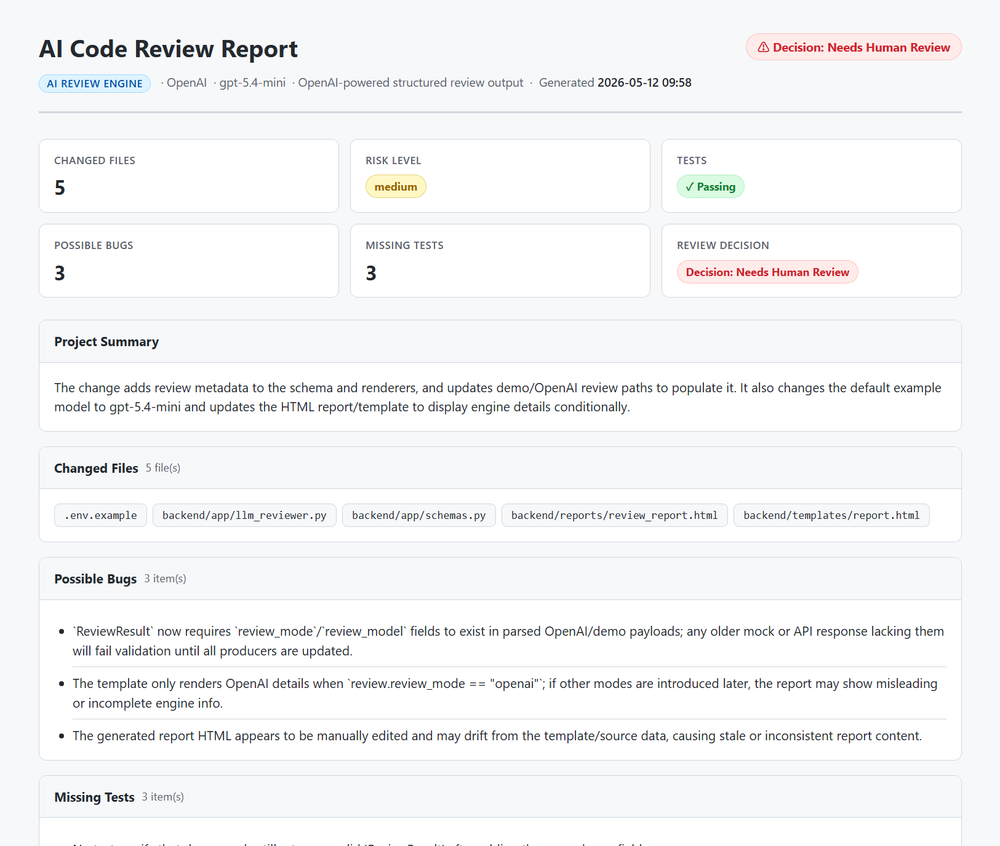

# AI Code Review & QA Automation Platform

A portfolio-ready MVP for automated code review and QA reporting. The tool reads Git changes, runs automated tests, generates structured AI review feedback, validates the result with Pydantic, and outputs a clean HTML report.

This project is positioned for Junior AI Engineer and AI Automation Engineer roles. It supports demo mode by default and optional OpenAI-powered structured review mode when an API key is configured. The current portfolio version demonstrates OpenAI-powered review output with Pydantic validation and fallback to demo mode.

## Why This Is Useful

Modern teams need fast feedback before code reaches human reviewers. This tool helps by combining diff analysis, automated test execution, structured AI review notes, and a shareable HTML report. It can run safely in demo mode without credentials, or use OpenAI mode for real structured review output while keeping a demo fallback if the API call or validation fails.

## Key Features

- Optional OpenAI-powered structured code review
- Demo fallback mode
- Structured JSON review output validated with Pydantic
- Git working-tree and commit-range diff support
- Automatic test command detection for Python, Node.js, and .NET projects
- Automated test execution
- GitHub-style HTML report generated with Jinja2
- Local golden-case eval harness
- Markdown/HTML eval summary artifacts
- GitHub Actions artifact upload

## Sample Report Screenshot



## Architecture / Workflow

```text
Developer pushes code or runs CLI
        |
        v
Git diff reader
        |
        +--> changed files
        +--> raw diff
        |
        v
Test runner detects project type
        |
        +--> pytest
        +--> npm test
        +--> dotnet test
        |
        v
Review engine creates structured JSON
        |
        +--> demo mode
        +--> OpenAI mode
        |
        v
Pydantic schemas validate review and test results
        |
        +--> Jinja2 HTML review report
        +--> eval harness regression report
```

## Tech Stack

- Python 3.11
- Pydantic
- Jinja2
- Pytest
- Git
- GitHub Actions

## Local Setup

```bash
git clone https://github.com/yy31104/ai-code-review-qa.git
cd ai-code-review-qa

python -m venv .venv
source .venv/bin/activate  # Windows: .venv\Scripts\activate

python -m pip install --upgrade pip
python -m pip install -r backend/requirements.txt
```

## Review Modes

Demo mode is the default and does not require an API key:

```bash
AI_REVIEW_MODE=demo
```

To configure optional OpenAI review mode, copy the example env file and add your own API key:

```bash
cp .env.example .env
```

```text
AI_REVIEW_MODE=openai
OPENAI_API_KEY=your_api_key_here
OPENAI_MODEL=gpt-5.4-mini
```

When `AI_REVIEW_MODE=openai`, the CLI sends the git diff and changed files to the OpenAI Responses API and validates the structured JSON response against the existing Pydantic `ReviewResult` schema. If the API key is missing, the API call fails, or the model response cannot be validated, the tool falls back to demo mode and includes a warning in the report summary. API keys are loaded from `.env` and should never be committed.

## CLI Usage

### Local Working-Tree Review

Run the MVP review workflow against the included sample Python project:

```bash
python backend/app/main.py --repo ./sample-projects/python-demo --output backend/reports/review_report.html
```

This mode inspects the current uncommitted working-tree diff for the target project.

### Commit Range Review

Run the review against an explicit Git commit range:

```bash
python backend/app/main.py --repo . --base HEAD~1 --head HEAD --output backend/reports/review_report.html
```

This mode compares `<base>..<head>` and is the mode used by GitHub Actions.

Both modes will:

- inspect Git changes for the target project
- detect and run the appropriate test command
- create structured review output using demo or OpenAI mode
- generate an HTML review report

## Eval Harness

The local eval harness provides a deterministic regression baseline for the demo review engine. It is designed to run without API keys and to catch behavior drift before the project expands into PR comments, API service mode, or richer model comparisons.

Run the seed eval dataset:

```bash
python evals/run_local.py --out reports/evals/results.json
```

Render Markdown and HTML summaries:

```bash
python evals/render_report.py \
  --in reports/evals/results.json \
  --md reports/evals/summary.md \
  --html reports/evals/summary.html
```

The 23-case seed dataset currently covers:

- authentication/token changes without tests
- test-only changes that should stay low risk
- large cross-file changes that should raise risk level
- subprocess, SQL, delete, and payment-sensitive changes
- risk terms inside camelCase/PascalCase identifiers
- false-positive guards for nearby low-risk terms
- empty-diff/untracked-file cases with limited line-level analysis

## Local Tests

Run the Python test suite:

```bash
python -m pytest -q
```

The tests cover the eval dataset loader, local eval CLI, and report rendering command.

## GitHub Actions CI Usage

The workflow in `.github/workflows/ai-review.yml` runs on:

- push to `main`
- pull request to `main`
- manual `workflow_dispatch`

In CI, GitHub Actions checks out the repository, installs backend dependencies, runs the CLI with `--base HEAD~1 --head HEAD`, and uploads the generated report as an artifact named `review-report`.

The workflow in `.github/workflows/evals.yml` runs the eval harness on:

- pull request to `main`
- push to `main`
- manual `workflow_dispatch`
- nightly schedule

It runs pytest, runs the golden-case evals, renders Markdown/HTML eval summaries, uploads `eval-report`, and publishes the Markdown summary to the GitHub job summary.

## HTML Report Artifact

The generated review report is saved to:

```text
backend/reports/review_report.html
```

It includes:

- project summary
- changed files
- risk level
- possible bugs
- missing tests
- suggested test cases
- security and reliability concerns
- automated test results
- recommended actions
- human review decision

The committed report is included as a sample portfolio artifact.

## Current MVP Status

Complete MVP:

- CLI workflow is implemented
- sample Python project is included
- automated tests run successfully
- HTML report generation works locally and in CI
- current portfolio report demonstrates OpenAI-powered structured review output
- demo fallback remains available for local and CI-safe execution
- first deterministic eval harness baseline is implemented
- GitHub Actions eval workflow is available for PR/manual/nightly runs

## Future Improvements

- GitHub PR diff support
- richer prompt evaluation and reviewer tuning
- React dashboard
- ASP.NET Core API
- Docker packaging
- Historical review storage
