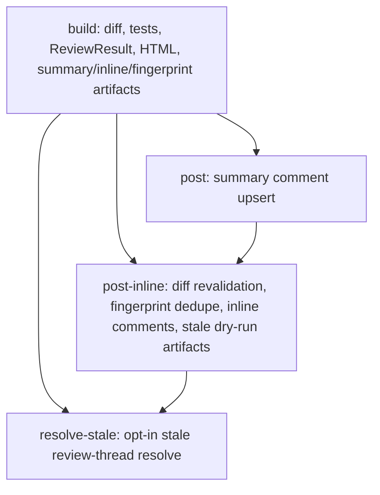

# Portfolio Engineering Summary

## Project Pitch

`ai-code-review-qa` is a portfolio-grade AI-assisted SDLC tool that turns a pull request diff into deterministic review artifacts a developer can verify before merge. It reads the Git diff, runs detected local tests, creates a structured review result, derives a test-aware verdict, renders an HTML report, and can optionally publish a GitHub summary comment, inline review comments, stale inline diagnostics, and non-destructive stale review-thread resolution.

The important engineering choice is that AI output is not treated as an unchecked side effect. Demo mode is deterministic and credential-free by default, OpenAI mode is explicitly configured and schema-validated, GitHub writes are opt-in, and the stale lifecycle is artifact-driven before any mutation is attempted.

## End-To-End Lifecycle

The completed same-repository PR review lifecycle is:

1. **Diff reader:** `backend/app/git_diff_reader.py` reads working-tree or commit-range diffs. The same-repo PR workflow uses `git merge-base` so artifacts are built from the PR's true `<merge-base>..<head>` diff.
2. **Test runner:** `backend/app/test_runner.py` detects Python, Node, and .NET test commands and captures sanitized test output for the review report.
3. **Review engine:** `backend/app/llm_reviewer.py` runs deterministic demo mode by default. Optional OpenAI mode is gated by `AI_REVIEW_MODE=openai` plus `OPENAI_API_KEY`, truncates diff egress at `MAX_DIFF_CHARS`, validates the response, and falls back to demo mode on configuration, API, or schema failures.
4. **Schema boundary:** `backend/app/schemas.py` owns `ReviewResult`, `Finding`, and `TestResult`. Both demo and OpenAI paths must produce a `ReviewResult` before reporting continues.
5. **Verdict engine:** `derive_decision()` recomputes the final verdict from risk level plus automated test status, producing `needs_human_review`, `review_recommended`, or `looks_good`.
6. **HTML report:** `backend/app/report_generator.py` renders the human-readable HTML artifact.
7. **Summary comment:** `.github/workflows/pr-summary.yml` can upsert one marker-owned top-level PR summary comment when `AI_REVIEW_SUMMARY_AUTOPOST=true`.
8. **Inline comments:** When `AI_REVIEW_INLINE_COMMENTS=true` is also set, the workflow recomputes the PR diff, revalidates each inline line against `DiffIndex`, filters duplicate finding fingerprints, and posts a capped GitHub create-review payload.
9. **Stale detection dry-run:** `github_inline_stale.py` compares marker-owned inline comments with current finding fingerprints and emits `stale-plan.json`.
10. **Stale resolve plan:** `github_inline_resolve_plan.py` maps stale REST review comment IDs to GraphQL review thread node IDs and applies eligibility rules: thread found, marker present, author is `github-actions[bot]`, and thread is not already resolved.
11. **Opt-in stale resolve:** `github_inline_resolve_apply.py` selects eligible thread node IDs, and the isolated `resolve-stale` job calls only GraphQL `resolveReviewThread` when `AI_REVIEW_STALE_ACTION=true`.

## PR Summary Workflow Graph

The same-repository PR workflow is intentionally staged so each write surface has a narrower gate than the artifact generation step.

Workflow gates:

- `build` runs only for same-repository PRs: `github.event.pull_request.head.repo.full_name == github.repository`.
- Fork PRs are skipped entirely by this workflow; they are not checked out, tested, artifacted, or commented on.
- `post` additionally requires `vars.AI_REVIEW_SUMMARY_AUTOPOST == 'true'`.
- `post-inline` additionally requires `vars.AI_REVIEW_SUMMARY_AUTOPOST == 'true'` and `vars.AI_REVIEW_INLINE_COMMENTS == 'true'`.
- `resolve-stale` additionally requires `needs.build.result == 'success'` and `vars.AI_REVIEW_STALE_ACTION == 'true'`.
- The project uses `pull_request`, not `pull_request_target`.
- The only GraphQL mutation in the PR summary workflow is `resolveReviewThread`, and it is isolated to the opt-in `resolve-stale` job.

## Trust And Safety Gates

| Variable | Enables | Blast radius | Default | Failure behavior |
| --- | --- | --- | --- | --- |
| `AI_REVIEW_MODE=openai` | Optional OpenAI-backed structured review in local/CLI paths | Diff and changed-file list egress to OpenAI, truncated by `MAX_DIFF_CHARS` | Demo mode | Missing key, API failure, unknown mode, or schema failure falls back to deterministic demo mode |
| `AI_REVIEW_SUMMARY_AUTOPOST=true` | Marker-owned top-level PR summary comment upsert | One PR conversation comment on same-repo PRs | Off | Build artifacts still exist; posting is isolated to the `post` job |
| `AI_REVIEW_INLINE_COMMENTS=true` | Capped inline create-review comments after summary posting | New inline review comments on same-repo PRs | Off | Create-review failures warn and keep the job green because the summary comment is the fallback |
| `AI_REVIEW_STALE_ACTION=true` | Non-destructive stale review-thread resolution via GraphQL `resolveReviewThread` | Resolves eligible bot-owned marker review threads only | Off | Pre-mutation steps are `continue-on-error`; missing `resolve-apply.json` exits cleanly; per-thread failures warn and continue |

Non-variable gates:

- `pull_request_target` remains forbidden.
- `pull-requests: write` is scoped only to summary posting, inline posting, and opt-in stale resolve jobs.
- Posted comment bodies are passed through JSON files to `gh api`, not interpolated into shell commands.
- Stale action eligibility requires marker ownership plus `github-actions[bot]` author ownership; humans and other bots are ineligible even if they copy the marker.

## Eval-Driven Development

The eval harness is a deterministic regression gate for the review engine, not a broad claim about model quality.

- `evals/data/golden_cases.jsonl` currently contains 25 hand-reviewed cases.
- `python evals/run_local.py --out reports/evals/results.json` currently reports 25/25 cases and 206/206 checks passing.
- Evals force deterministic demo mode through the public `review_diff()` path, so behavior changes are tested without API keys.
- `.github/workflows/evals.yml` runs pytest, the eval harness, and Markdown/HTML eval report rendering on pull requests, pushes to `main`, manual dispatch, and a nightly schedule.
- The evals cover risk, missing-test, false-positive, anchor-position, and review-decision behavior. They are a regression baseline for the current deterministic reviewer; they do not measure real developer acceptance rate or prove LLM review quality.

## Artifact-Driven CI

The workflow exposes intermediate state as artifacts so humans can audit what happened before trusting an automated comment or resolve action.

- `pr-summary-artifacts`: HTML report, summary comment body, inline review payload, and finding fingerprints.
- `pr-inline-to-post`: inline post payload plus stale detection and stale action planning artifacts.
- `pr-stale-resolve`: existing review comments, stale plan, GraphQL review threads, stale action plan, selected thread IDs, and the final thread-node-id list.
- `eval-report`: eval result JSON plus Markdown/HTML summaries.

This artifact-first approach makes the GitHub automation inspectable: the reviewer can compare the diff, fingerprints, stale plan, and resolve apply file before deciding whether an opt-in mutation path is safe to keep enabled.

## Known Limitations

- The outer `reviewThreads` connection is paginated in the `resolve-stale` execute path with `gh api graphql --paginate --slurp`, but each thread's inner `comments(first: 100)` connection is not paginated. That creates a safe under-resolve bias: deeply long review threads may fail to match an eligible stale comment instead of resolving something uncertain.
- The PR #18 variable-on canary proved the default-off gate and empty-action execute path. A live non-empty stale resolve happy path is documented as a manual runbook verification, not as an already automated mutating CI canary.
- This is not a GitHub App and does not support fork PR mutation. Fork PRs are skipped by design.
- The demo reviewer is deterministic and intentionally simple; it is not a security scanner or a model-quality benchmark.
- OpenAI mode is optional and account-policy dependent; this repository does not control OpenAI retention, billing, or organization settings.

## Interview Talking Points

- **Schema-first AI boundary:** AI output must pass through `ReviewResult` validation before it becomes a report, comment payload, or eval artifact.
- **Fail-safe GitHub automation:** Same-repo gates, opt-in variables, no `pull_request_target`, minimal permissions, JSON-file `gh api` inputs, and non-fatal write failures keep automation from becoming a hidden merge blocker.
- **Diff anchoring and revalidation:** Inline comments are generated from validated right-side diff lines, then revalidated at posting time before GitHub receives a create-review request.
- **Artifact-driven CI:** The workflow saves review, inline, stale, resolve, and eval artifacts so each stage can be inspected instead of trusted blindly.
- **Non-destructive stale lifecycle:** Stale comments are detected and planned before action; the only execute path is GraphQL review-thread resolve, never delete, edit, reply, or minimize.
- **Safe opt-in mutation design:** `AI_REVIEW_STALE_ACTION` is off by default, same-repo only, fail-safe, and limited to bot-authored marker-owned unresolved threads selected by a pure stdlib selector.

## 60-120 Second Interview Pitch

"This is an AI-assisted code review tool, but the core work is the production boundary around the AI. A PR workflow reads the real merge-base diff, runs deterministic tests, produces a schema-validated `ReviewResult`, derives a test-aware verdict, and emits an HTML report. From there, GitHub writes are staged and opt-in: first a marker-owned summary comment, then capped inline comments after diff revalidation and fingerprint dedupe, then stale detection artifacts, and finally an optional non-destructive stale resolve job that only calls GraphQL `resolveReviewThread` for eligible bot-owned marker threads.

The project is safe by default: demo mode is credential-free, OpenAI mode is explicit and falls back to demo, fork PRs are skipped, `pull_request_target` is not used, and every write surface is behind a repository variable. I also built a deterministic eval harness with 25 golden cases and 206 checks, so changes to review behavior are caught in CI. I am careful not to overclaim: the evals are a regression suite for the deterministic reviewer, not proof of LLM quality, and the live non-empty stale resolve path is documented as a manual canary runbook because the merged PR #18 canary produced an empty resolve plan."
